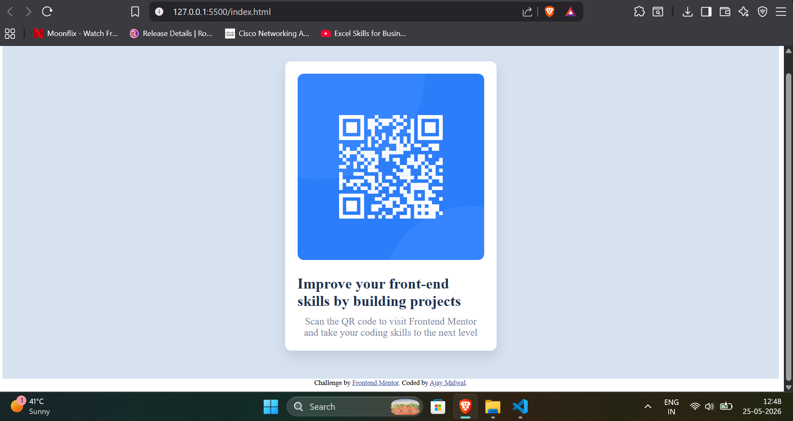
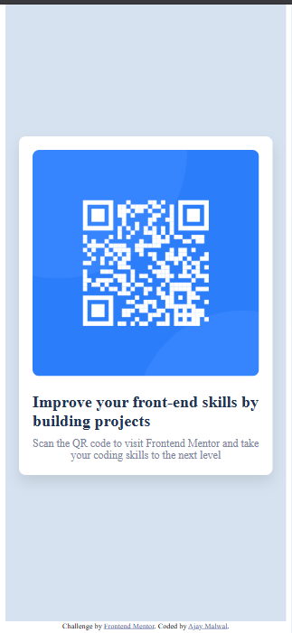

# Frontend Mentor - QR code component solution

This is a solution to the [QR code component challenge on Frontend Mentor](https://www.frontendmentor.io/challenges/qr-code-component-iux_sIO_H). Frontend Mentor challenges help you improve your coding skills by building realistic projects. 

## Table of contents

- [Overview](#overview)
  - [Screenshot](#screenshot)
  - [Links](#links)
- [My process](#my-process)
  - [Built with](#built-with)
  - [What I learned](#what-i-learned)
- [Author](#author)


## Overview

### Screenshot




### Links

- Solution URL: [Add solution URL here](https://your-solution-url.com)
- Live Site URL: [Add live site URL here](https://your-live-site-url.com)


## My Process

### Built with

- Semantic HTML5 markup
- CSS custom properties
- Flexbox
- Flexbox column
- Mobile-first workflow

### What I learned

I learned that flexbox helps to create the responsive websites without writing a sparte code for mobile version and desktop version.

```
.card{
    display:flex;
    flex-direction:column;
    align-items:center;
    justify-content:center;
    background-color:#fff;
    border-radius:10px;
    padding:20px;
    box-shadow:0px 10px 20px rgba(0, 0, 0, 0.1); 
}
```
```
.container{
    display:flex;
    flex-direction:column;
    align-items:center;
    justify-content:center;
    height:100vh;
    width:100%;
    background-color:hsl(212, 45%, 89%);
    padding:20px;
    box-sizing:border-box;
}
```

## Author

- Website - [Ajay Malwal](https://www.ajaymalwal.in)
- Frontend Mentor - [@Ajaymalwal](https://www.frontendmentor.io/profile/Ajaymalwal)

